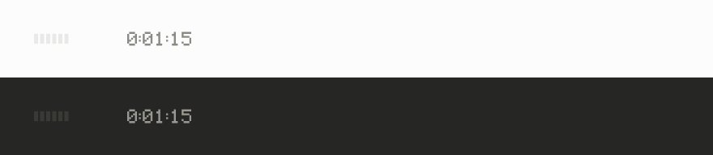
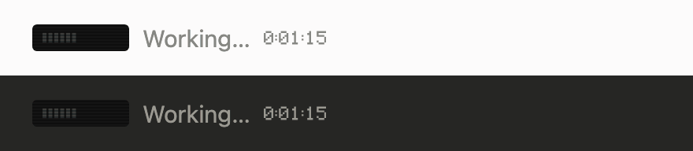
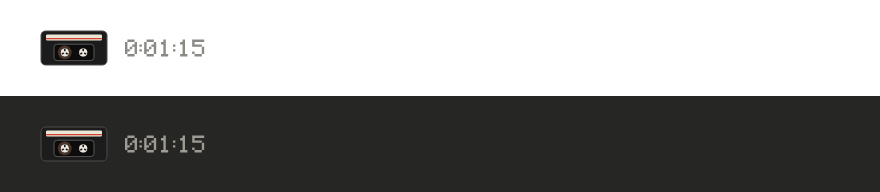
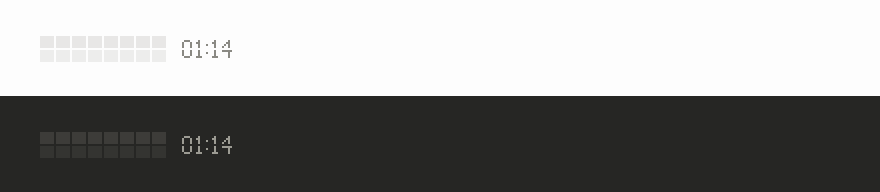
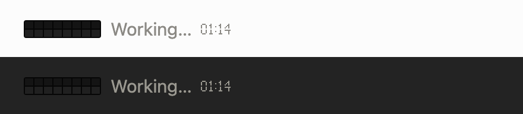
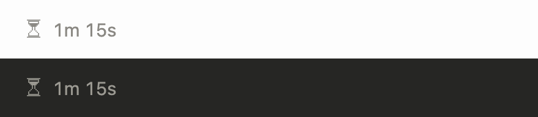
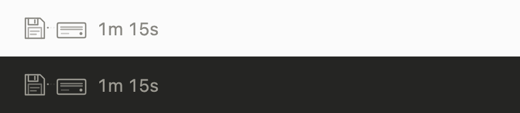
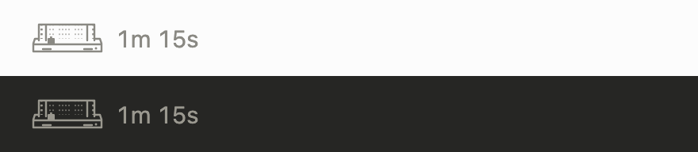
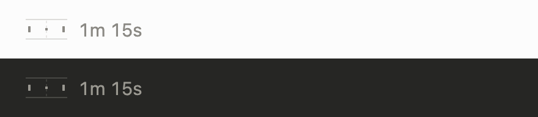
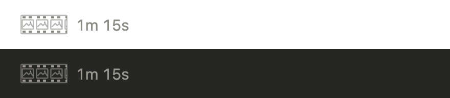

# nowloading

The line that animates while Claude Code works, redrawn as something from before.

It replaces the three little dots with an old machine at work: a VCR's on-screen display, a split-flap departure board, a one-bit hourglass, a floppy drive, a dot-matrix printer, an arcade rally or a filmstrip. Each one follows what Claude is actually doing: thinking, running a tool, a tool failing, writing the answer. It works in the desktop app's Code tab and in the terminal, where Ghostty and kitty show it as real pixels.

| Theme | |
| --- | --- |
| `rewind`: the VCR's on-screen word in your text color. Pause while it thinks, fast-forward through tools, play while it writes. On the desktop, the tape counter is the time. |  |
| `channel3`: the same display on a tiny screen, with scanlines and a slow tracking roll. |  |
| `cassette`: a tape whose reels turn at the speed of the transport. |  |
| `platform`: a turn is a flight. CHECK IN, BOARDING, EN ROUTE, LANDING, and DELAYED when a tool fails. The board riffles only when its word changes. |  |
| `arrivals`: the same board at night. On the desktop, both boards keep time on a flap clock. |  |
| `sandglass`: the wait cursor of an older desktop. The sand runs while it works, the glass turns over when a tool succeeds and tips over when one fails. |  |
| `floppy`: a floppy disk and its drive. The shutter seeks while thinking, data travels during tools and writing, and a failed tool rattles the disk. |  |
| `dotmatrix`: a print head crosses tractor paper. It prints through tools, parks on success, and creases the paper when a tool jams. |  |
| `rally`: two paddles keep a rally going. A tool speeds up the game; success lands a clean return, and failure misses the paddle. |  |
| `filmstrip`: frames and sprocket holes pass through a projector gate. It holds a frame while thinking and stops on a check or a jam after a tool. |  |

## Install

In Claude Code:

```
/plugin marketplace add vgnshiyer/mods
/plugin install nowloading@vgnshiyer-mods
```

Requires a Claude Code version with mods (function hooks). [vgnshiyer/mods](https://github.com/vgnshiyer/mods) lists my other mods too.

## Use

- `/nowloading`: shows the current theme and lists the others.
- `/nowloading arrivals`: switches now, mid-turn included, and every session after uses it.
- `/nowloading random`: a different theme every turn.

The `theme` setting in `/config` picks one too. Whichever you set last wins.

## What it touches

Nothing but the drawing. Every hook passes straight through, so Claude's prompts, context and tool calls are untouched, and nothing waits on the animation. Meaningful step text stays, including a message another mod set, along with the real elapsed time. On desktop, the generic “Working” placeholder is omitted; the running tool already has its own description. If a theme ever fails to draw, Claude Code draws its own line instead.

- **Desktop:** the turn's line becomes the art, then the time. `rewind`, `channel3`, `cassette`, `platform` and `arrivals` draw their own time: the tape counter or the flap clock. A running tool keeps its own line with its description, and a message another mod sets shows beside the art.
- **Terminal:** in Ghostty and kitty, the art is a picture at the start of Claude Code's own line, which keeps its verb, time and tokens. Other terminals, and tmux, show the theme's word in its place.

## Add a theme

A theme is one look in a family file.

1. Write `themes/<family>.js`. Export `{ key, title, blurb, looks }`, where each look is `{ name, label, note, art(s) }` and optionally `tail(s)`.
   - `art(s)` returns an SVG string 20px tall and the same width in every state, animated with SMIL. Draw in `currentColor` so it follows light and dark.
   - `s` is `{ mode, result, running, elapsed }`. `mode` is `requesting`, `thinking`, `tool-use` or `responding`. `result` is a number after a tool succeeds and `'error'` after it fails.
   - `tail(s)` is optional and replaces the time on the desktop. It must show the real elapsed time.
   - Keep the markup unchanged for an unchanged state so the animation can continue. For terminal playback, use loop durations on a 0.1-second grid with a common period no longer than 3.2 seconds; result reactions should settle within 1.5 seconds.
   - `themes/vhs.js` is a complete example.
2. Add one import and one entry in `themes/index.js`, a fallback word in `hooks/state.ts`, and the theme's name to `userConfig.theme.options` in `.claude-plugin/plugin.json`.
3. Build the terminal frames: `node art/frames.mjs && python3 art/pack.py`.
4. Look at it: serve the repo (`python3 -m http.server`) and open `art/variations.html`. To see every state, light and dark, at 3x and real size, run `python3 art/render.py <family> /tmp/sheet`.
5. Record its GIF with `node art/gifs.mjs && python3 art/gif.py`, which writes `docs/<theme>.gif`, and add a row to the table above.
6. Run `claude plugin test .`, then open a pull request.

`art/` needs Node 22+, Python with Pillow, and Google Chrome. The scripts look for Chrome where macOS installs it; set `CHROME` to its path anywhere else.

To rebuild only selected themes, pass their names to the capture script: `node art/frames.mjs floppy dotmatrix rally filmstrip`, then `python3 art/pack.py`. The GIF recorder accepts the same names: `node art/gifs.mjs floppy dotmatrix rally filmstrip`, then `python3 art/gif.py`.

## License

MIT. All art is original. The themes evoke generic old machines, not any product or brand.
